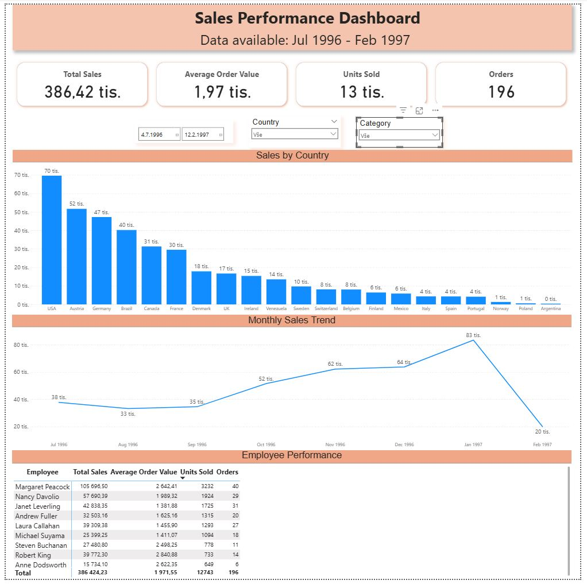

# Sales Performance Dashboard

This folder contains the Power BI report and its preview image.

The dashboard is designed for a **Sales / Commercial Manager** and provides a one-page overview of sales performance.

## Business Questions

The dashboard focuses on four main questions:

- What is the overall sales performance?
- Which countries generate the most sales?
- How are sales developing over time?
- How are individual employees performing?

## Key Metrics

- Total Sales
- Average Order Value
- Units Sold
- Orders

## Visualizations

- Sales by Country
- Monthly Sales Trend
- Employee Performance

## Interactive Filters

The dashboard can be filtered by:

- Date
- Country
- Category

The filters affect the relevant KPIs and visualizations consistently.

## Dashboard Preview

## Files

- `Sales_Performance_Dashboard.pbix` – interactive Power BI report
- `Sales_Performance_Dashboard.JPG` – dashboard preview

## Data Coverage

The available order data covers the period from July 1996 to February 1997.

Sales are calculated as `Quantity × Product Price`. Since historical transaction-level product prices are not available in the source data, the product price from the `Products` table is used.
